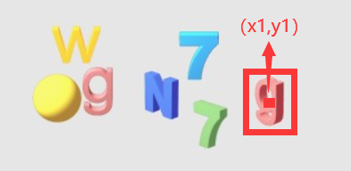
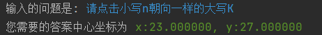
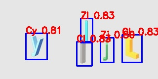

# Smart Tree Fucker

---
### &nbsp;&nbsp;&nbsp;&nbsp;狂躁医学生不想刷网课？一学期12门网课，**医学院我老X（情绪过于激动被带走）……<br />
### &nbsp;&nbsp;&nbsp;&nbsp;~~这是一款基于[Selenium](https://github.com/SeleniumHQ/selenium)开发自动刷智慧树网课的Python脚本。~~
#### &nbsp;&nbsp;&nbsp;&nbsp;这是一款基于[YOLOv5](https://github.com/ultralytics/yolov5)框架开发的针对易盾空间验证码进行识别并破解的自动验证码处理工具。因为在开发该工具过程中发现已经有大佬[@VermiIIi0n](https://github.com/VermiIIi0n)从[后端](https://github.com/VermiIIi0n/fuckZHS)（*）进入智慧树深处，所以这个自动识别智慧树上的空间推理验证码工具也没有什么用处了，所以就不再开发刷网课的脚本，只把这个工具单独上传了。  

😅文件树：  
```
zhuerding
   └─smart_tree  
       ├─datasets    # 里面是训练YOLOv5的数据集，内部结构不再展示
       │
       ├─img         # 里面是用来测试的验证码及其文本内容
       │
       ├─mods        # 一些开发过程中随便写的小工具
       │     ├─ output  # 某个小工具的输出文件夹
       │     ├─ tutle   # 某个小工具的基础元件文件夹
       │     │    ├─ A-Z #  某个小工具的基础元件文件夹
       │     │    ├─ Xa-z #  某个小工具的基础元件文件夹
       │     │    ├─ background.jpg  #  某个小工具所需要的背景图
       │     │    └─ predefined_classes.txt  #  某个小工具所需要的标签文件
       │     ├─ chromedrive.exe # 某个谷歌浏览器驱动
       │     ├─ generate.py  # 验证码生成脚本
       │     ├─ read.py  # 真·验证码爬取脚本
       │     └─ word_creative.py  # 元件生成脚本
       │
       ├─ readme_img  # 本README.md中图片存放的地方
       │ 
       ├─ Reqfile  # 存放炉石的地方
       │     ├─ best_simple.onnx  # 朝向与字符识别炉石
       │     └─ color.onnx   # 颜色识别炉石
       │
       ├─ utils # 存放主体程序的文件夹
       │     ├─ classify_color.py  # 用于颜色识别的函数
       │     ├─ detmin_main.py  # 用于整合其他函数信息的主程序
       │     ├─ detect.py  # 用于文字和朝向识别的主函数
       │     └─ segmentation_jieba.py  # 用于对问题进行分词识别的主函数
       │
       ├─ requirement.txt  # 运行本程序需要的包
       │
       ├─ main.py  # 本项目主程序
       │
       └─ README.md  # 千万不要打开
```
---
### 食用前：
~~请根据以下步骤清洗双手：内、外、夹、弓、大、立、腕~~<br />
- 首先确保您的python版本 >= 3.9，本项目基于python 3.9开发。  
- 然后通过pip的方式下载依赖的包：<br />
```pip install -r requirement.txt -i https://pypi.tuna.tsinghua.edu.cn/simple```
### 食用中<br />
#### 输入：
 &nbsp;&nbsp;&nbsp;&nbsp;本工具如果在不改变项目结构和识别效果的情况下仅需修改两个参数   

    content = '请点击小写n朝向一样的大写K'  # 你提出的与图片对应的问题 
    image_path = r'./img/20.jpg'  # 与问题对应的图片
 &nbsp;&nbsp;&nbsp;&nbsp;一个是```content```参数，其输入的是与输入图片相对应的文字题目；另一个是```image_path```，其输入的是与输入文字相对应的图片地址。两者为必填内容。  
  &nbsp;&nbsp;&nbsp;&nbsp;如果您需要与Selenium相结合，可以参考[read.py](./mods/read.py)中爬取易盾官网上验证码的代码，一般来说其他用了易盾空间推理验证码的网站，其验证码图片名不会更改。  

#### 输出：
 &nbsp;&nbsp;&nbsp;&nbsp;本程序的最终结果为了简便显示，仅会输出最终答案所在图片上的中心坐标。如图所示：  
   
 &nbsp;&nbsp;&nbsp;&nbsp;输出答案的格式如图所示：  
   

 &nbsp;&nbsp;&nbsp;&nbsp;以上推理仅需要CPU支持，不需要GPU（而且我也没有写使用GPU的函数）
 
    answer = {"name": name,  # 答案文字
          "direct": front,  # 答案文字的朝向
          "color": gray,  # 答案文字的颜色
          "square": 6,   # 答案文字区域的面积
          "crop": [6,6,6,6]   # 答案文字区域的坐标，(x1,y1,x2,y2)}
以上为```answer```的结构，可以自行进行调用。

### 食用后：<br />
## FBI Warning：
- 当您使用本程序时，您可能会触犯相关法律，请您注意
- 本程序在在文字识别经去重后，对易盾空间推理验证码文字识别准确度可达99%以上，但是由于验证码的**操作，大写的I和小写的l实在难以区别，后期发现无法区别问题也没时间纠正，只能等之后修复这个Bug了。 <br /> 
  
- 本程序在颜色识别方面需要提升，但是本人是医学牲……不会CV相关算法，所以只能炼丹，如果出现```部分颜色识别失败，可能影响识别效果```提示，其输出结果不一定可信，可信度约80%左右
- 最后祝您吃饱喝饱，一路走好~
### Thanks：<br />
- New Bing
- [@qq_22487889](https://blog.csdn.net/qq_22487889?type=blog)这位博主的[《详细介绍 Yolov5 转 ONNX模型 + 使用ONNX Runtime 的 Python 部署》](https://blog.csdn.net/qq_22487889/article/details/128011883)一文，本人参考 ~~抄袭~~ 甚多。
- 某不知名同学的几个小时的打标记工作（所以有没有办法用AI帮我打标记（滑稽））

### At last:
  程序作者：**zhuerding**（一个**胡桃厨**）  
    
  本程序遵循**GNU（GNU General Public License）通用公共许可协议**，源代码及其衍生代码的开源且免费使用并可以引用、修改，但不允许修改后和衍生的代码做为闭源的商业软件发布和销售。希望其他基于本程序开发的同学们遵守该协议。  